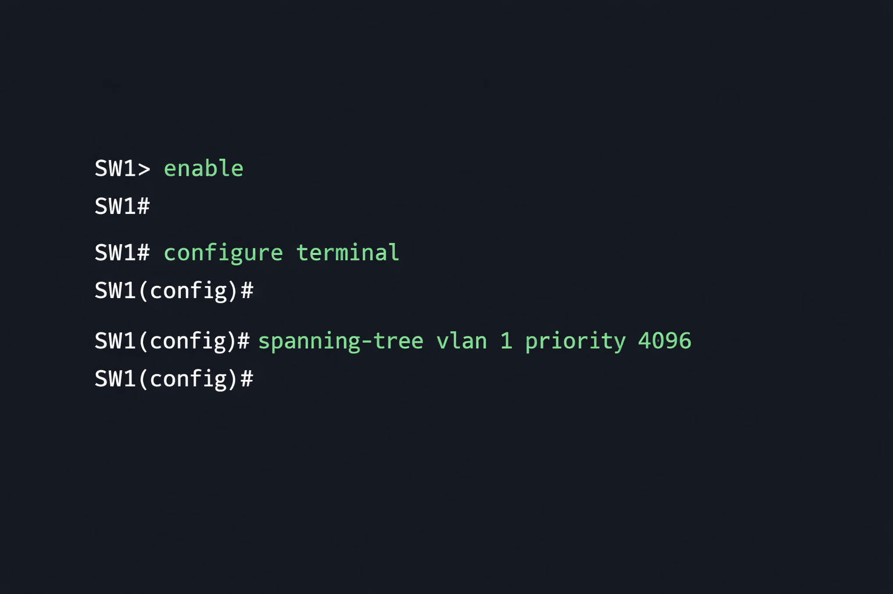
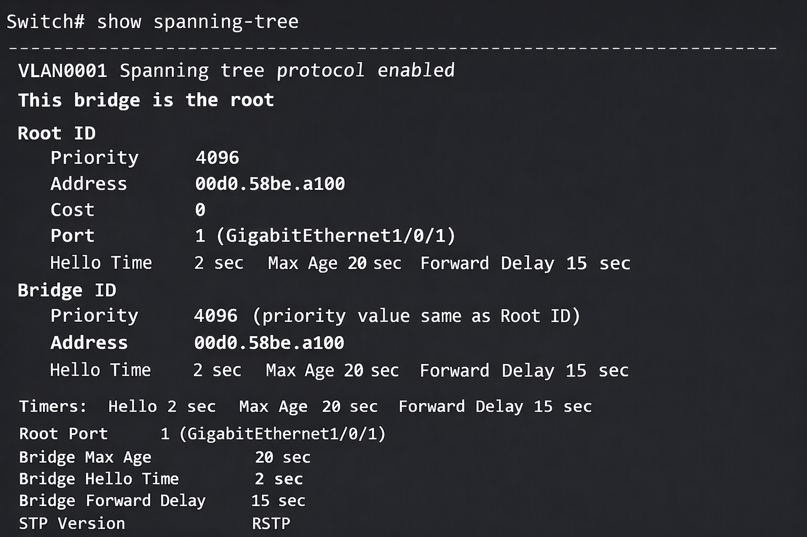
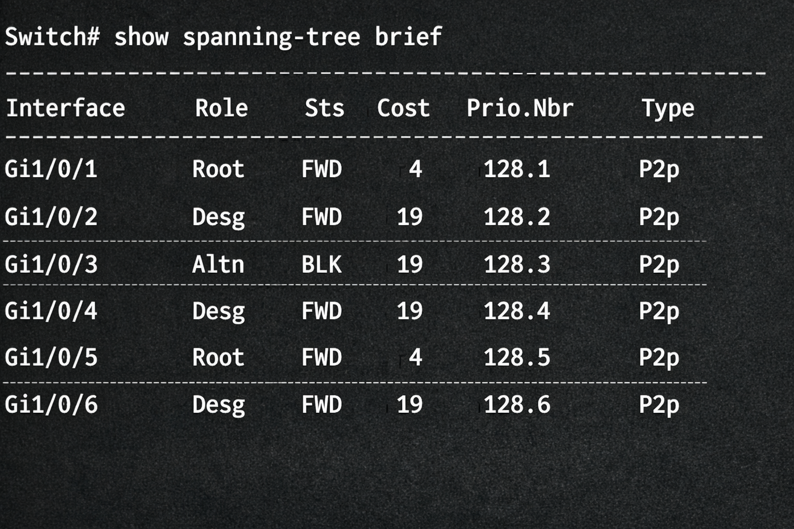
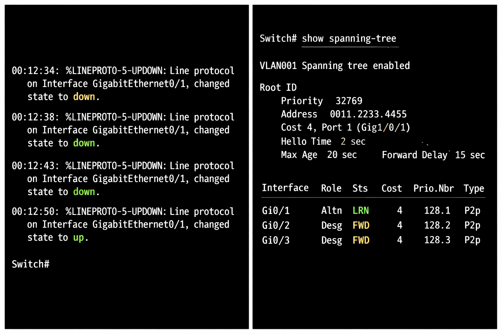
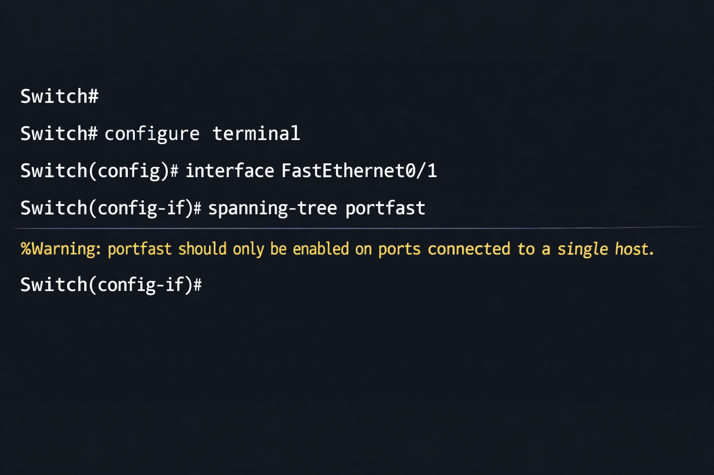

# 🌐 Spanning Tree Protocol (STP) Lab

---

## 📌 Objective

The objective of this lab is to configure and validate **Spanning Tree Protocol (STP)** to prevent Layer 2 loops in a switched network. This lab demonstrates how STP elects a root bridge, blocks redundant paths, and reconverges during network failures.

---

## 🧠 Concept Overview

Spanning Tree Protocol (STP) is a Layer 2 network protocol used to ensure a loop-free topology for any bridged Ethernet local area network.

### Key Benefits:
* **Loop Prevention** → Eliminates broadcast storms and MAC table instability.
* **Redundancy** → Allows for multiple physical paths while maintaining a single logical path.
* **Automatic Recovery** → Reconfigures the network automatically if a link fails.

---

## ⚙️ Environment

| Device | Hostname | Role | Notes |
| :--- | :--- | :--- | :--- |
| Switch 1 | SW1 | Root Bridge | Manually configured with lowest priority |
| Switch 2 | SW2 | Secondary | Backup root bridge |
| Switch 3 | SW3 | Access | Connects end devices |

---

## 🛠️ Technologies Used

* IEEE 802.1D (STP)
* Cisco IOS CLI
* Layer 2 Switching
* PortFast & BPDU Guard

---

## 🔧 Lab Implementation

### Step 1: Set Root Bridge (SW1)
We manually set SW1 as the Root Bridge by lowering its bridge priority.



### Step 2: Verify Root Bridge
Confirm that SW1 has successfully been elected as the root.



### Step 3: Observe Port Roles
Identify which ports are in Forwarding (FWD) and which are in Blocking (BLK) states.



### Step 4: Simulate Link Failure
Observe how STP recalculates the topology when a primary link goes down.



### Step 5: Enable PortFast
Optimize access ports for immediate transition to the forwarding state.



---

## ✅ Verification Commands

```bash
show spanning-tree          # View detailed STP status
show spanning-tree brief    # Quick view of port roles and states
show spanning-tree vlan 1   # STP details for a specific VLAN
```

---

## 📂 Repository Structure

```text
enterprise-switch-lab/
│
├── README.md
├── GUIDE.md
└── screenshots/
    ├── STP_S01_Set_Root_Bridge.png
    ├── STP_S02_Verify_Root.png
    ├── STP_S03_Port_Roles.png
    ├── STP_S04_Failover.png
    └── STP_S05_PortFast.png
```

---

## 🚀 Author

**Zeyad Al Mahmoudi**
BCIT Technology Support Professional (TSP)
Focus: Networking | Systems Administration | Azure
