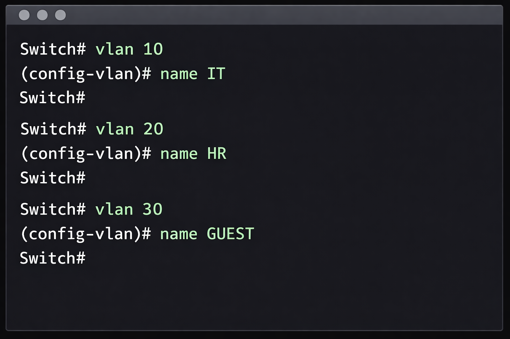
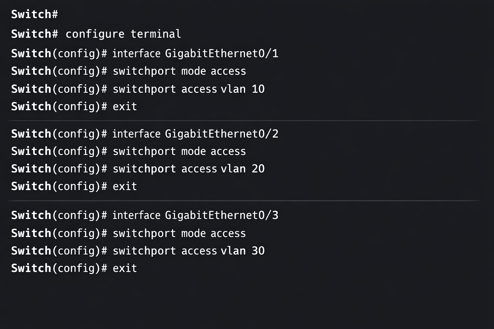
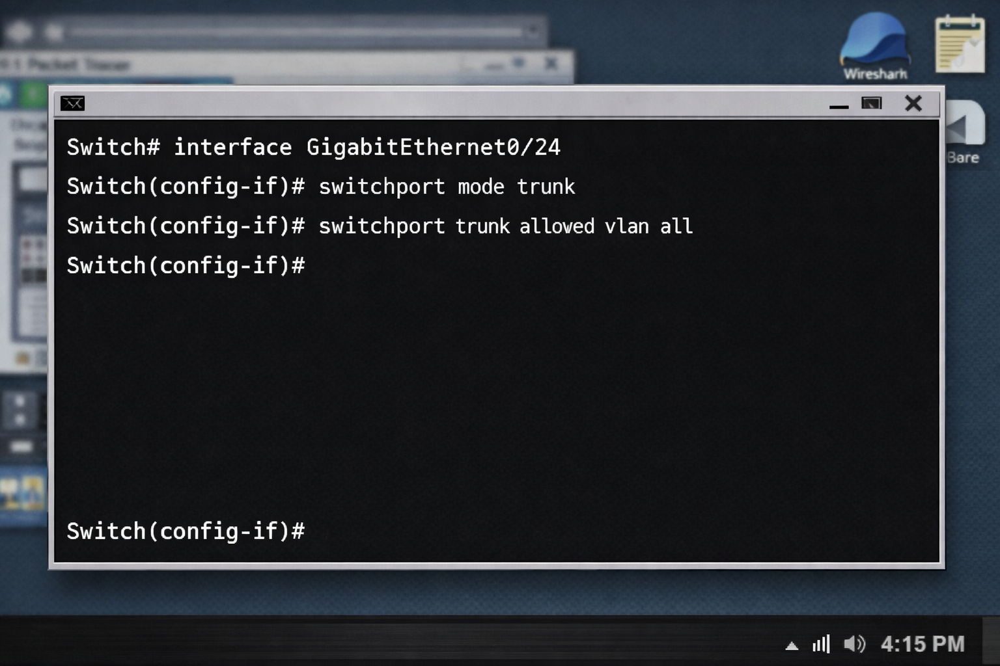
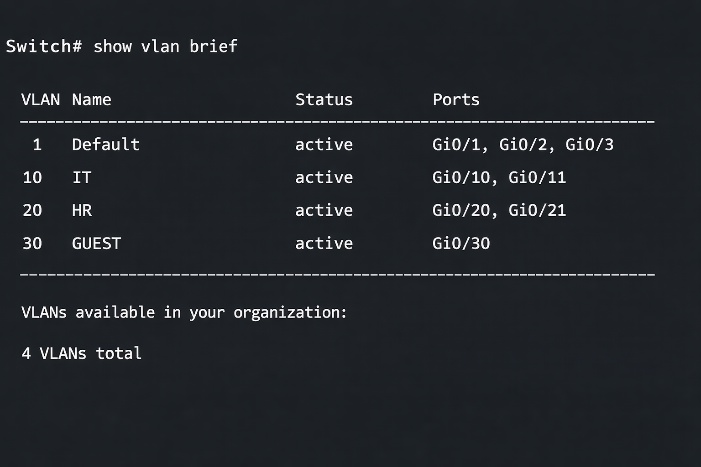

# VLAN Network Segmentation Lab

---

## 📌 Objective

The objective of this lab is to configure **Virtual LANs (VLANs)** on a switch to segment a network into multiple **broadcast domains**, improving security, performance, and network organization.

---

## 🧠 Concept Overview

A VLAN (Virtual LAN) allows a switch to divide a single physical network into multiple logical networks.

### Key Benefits:

* **Network Segmentation** → separates departments (IT, HR, Guest)
* **Improved Security** → restricts communication between groups
* **Reduced Broadcast Traffic** → limits broadcast domains
* **Better Performance** → less unnecessary traffic

---

## ⚙️ Environment

| Role     | Hostname  | Description    |
| -------- | --------- | -------------- |
| Switch   | SW1       | Layer 2 switch |
| Client 1 | IT-PC1    | VLAN 10        |
| Client 2 | HR-PC1    | VLAN 20        |
| Client 3 | GUEST-PC1 | VLAN 30        |

---

## 🛠️ Technologies Used

* VLAN (IEEE 802.1Q)
* Switch Port Configuration
* Access Ports
* Trunk Ports
* Hyper-V / Virtual Lab Environment

---

## 🗺️ Network Design

```text
        [SW1]
       /  |   \
 IT-PC1 HR-PC1 GUEST-PC1

VLAN 10  VLAN 20  VLAN 30
```

---

## 🔧 Lab Implementation

### Step 1: Create VLANs

Create the logical VLAN entities on the switch.



### Step 2: Configure Access Ports

Assign each physical port to the correct logical VLAN.



### Step 3: Configure Trunk Port

Configure trunking for VLAN propagation across switches.



### Step 4: Verify VLAN Configuration

Verify the database and port assignments.



---

## ✅ Verification

* Devices in the **same VLAN** can communicate successfully
* Devices in **different VLANs cannot communicate**
* Broadcast traffic is limited to each VLAN

---

## 🔍 Testing Results

| Test               | Result  |
| ------------------ | ------- |
| IT-PC1 → IT-PC1    | Success |
| IT-PC1 → HR-PC1    | Failed  |
| HR-PC1 → GUEST-PC1 | Failed  |

---

## 📂 Repository Structure

```text
vlan-network-segmentation-lab/
│
├── README.md
├── GUIDE.md
└── screenshots/
    ├── VLAN_S01_Create_VLANs.png
    ├── VLAN_S02_Access_Ports.png
    ├── VLAN_S03_Trunk.png
    └── VLAN_S04_Verification.png
```

---

## 🚀 Author

**Zeyad Al Mahmoudi**
BCIT Technology Support Professional (TSP)
Focus: Networking | Systems Administration | Azure
